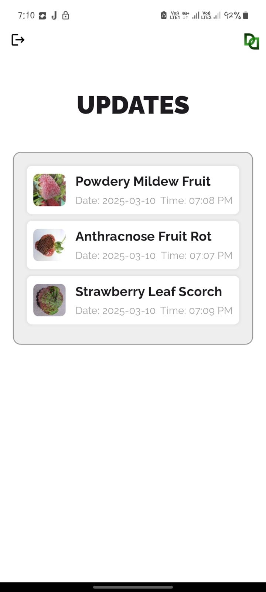
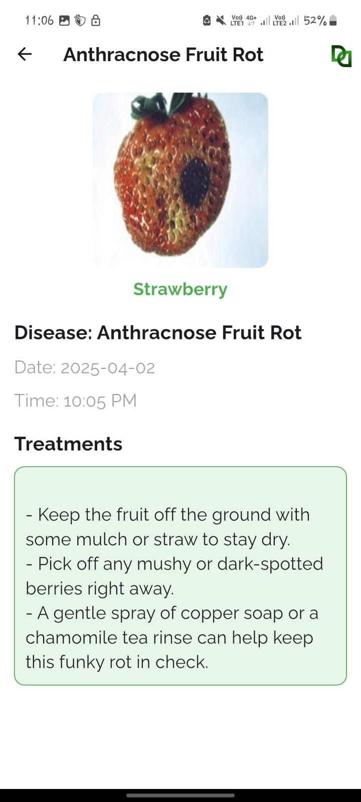

# Plant Disease Detection Application
This project is a mobile application designed to detect plant diseases in real-time using a camera. The app leverages a ResNet-50 deep learning model to identify diseases from plant leaf images and provides detailed predictions. It is built using Flutter for the front-end and Firebase for cloud storage and real-time database functionalities.

## Purpose
The goal of this project is to provide farmers and agricultural experts with a simple and effective tool to identify plant diseases early, helping them make informed decisions and reduce crop losses. The app bridges the gap between AI-driven disease diagnostics and accessible mobile solutions.

## Usage
1. Capture images of plant leaves using the ESP32 cam
2. Process and predict diseases using a pre-trained ResNet-50 model
3. Upload images and results to Firebase
4. View history of analyzed images with predictions and timestamps
5. Cross-platform (Android) user interface built with Flutter

## Tech Stack
1. Frontend: Flutter (Dart)
2. Backend/ML: Python (ResNet-50 model, TensorFlow/PyTorch)
3. Cloud: GCP (hosting server), Firebase (Firestore, Storage)
4. IDE Platform: Lightning  AI (for handling heavy GPU process/models)
5. Other Tools: Camera plugin, REST API integration, JSON parsing

## 📸 Screenshots

  
  

  
  

